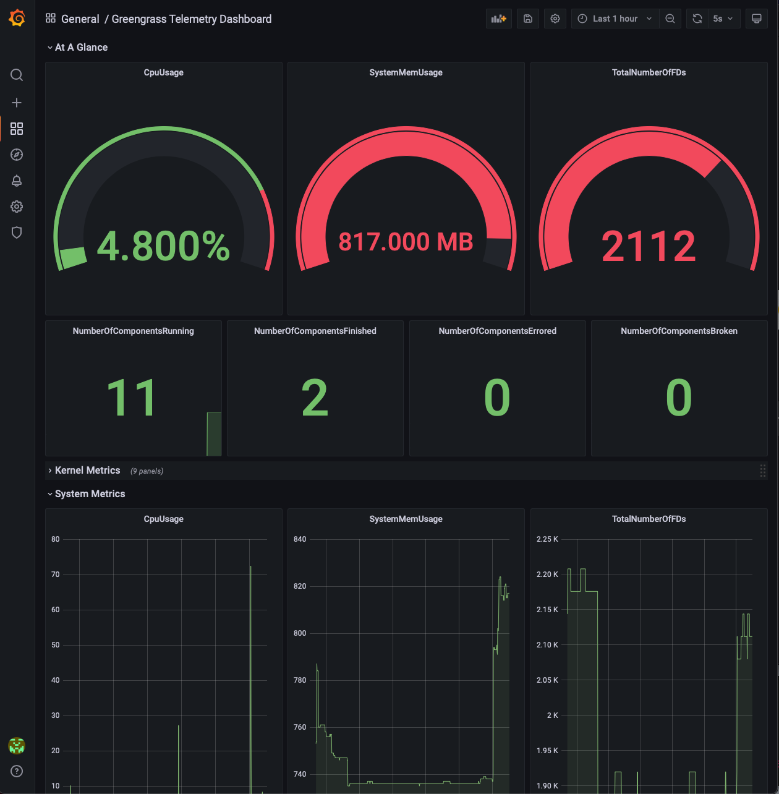

## Greengrass Labs InfluxDB Grafana Dashboard Component - `aws.greengrass.labs.dashboard.InfluxDBGrafana`

## Overview
This AWS IoT Greengrass component allows you to automatically provision and manage a local real-time telemetry dashboard with InfluxDB and Grafana on your device.

At a high level, the component will do the following:

1. Pull down the `aws.greengrass.labs.database.InfluxDB`, `aws.greengrass.labs.telemetry.InfluxDBPublisher`, and `aws.greengrass.labs.dashboard.Grafana` components and start them as component dependencies.
2. Once all dependencies are started, it will send a request to the IPC topic `greengrass/influxdb/token/request` (configurable) to retrieve InfluxDB read-only credentials and metadata from `aws.greengrass.labs.database.InfluxDB`
3. Receive a message on the IPC topic `greengrass/influxdb/token/response` (configurable).
4. Use the retrieved credentials and (optionally) InfluxDB HTTPS certs to create a new Grafana data source over HTTP/HTTPS to connect InfluxDB and Grafana.


This component works with the `aws.greengrass.labs.dashboard.Grafana`, `aws.greengrass.labs.telemetry.InfluxDBPublisher` and `aws.greengrass.labs.database.InfluxDB` components to persist and visualize Greengrass System Telemetry data.

The `aws.greengrass.labs.dashboard.InfluxDBGrafana` component automates the setup of Grafana with InfluxDB to provide a "one-click" experience, but this component still needs to be configured first before creation. See the `Setup` section below for instructions.
* [aws.greengrass.labs.telemetry.InfluxDBPublisher](https://github.com/awslabs/aws-greengrass-labs-telemetry-influxdbpublisher)
* [aws.greengrass.labs.database.InfluxDB](https://github.com/awslabs/aws-greengrass-labs-database-influxdb)
* [aws.greengrass.labs.dashboard.Grafana](https://github.com/awslabs/aws-greengrass-labs-dashboard-grafana)



## Configuration
The `aws.greengrass.labs.dashboard.InfluxDBGrafana` component supports the following configuration options.

* `SkipTLSVerify` - skip TLS verification, for self-signed HTTPS certificates
    * (`true` | `false` )
    * default: `true`

* `accessControl` - [Greengrass Access Control Policy](https://docs.aws.amazon.com/greengrass/v2/developerguide/interprocess-communication.html#ipc-authorization-policies), required for InfluxDB secret retrieval over pub/sub and AWS Secret Manager.
   * A default `accessControl` policy allowing publish access to the `greengrass/influxdb/token/request` topic and subscribe access to the `greengrass/influxdb/token/response` has been included, but you must configure the Secret Arn to be retrieved.
   
## Setup
**The following steps are for Ubuntu 20.04 x86_64, but will be similar for most platforms.**

### Prerequisites
1. Install dependencies on the host machine.
    ```
   sudo apt-get update; sudo apt-get install -y \
     ca-certificates \
     curl \
     gnupg \
     lsb-release \
     zip \
     default-jre \
     python3-pip; \
   python3 -m pip install awsiotsdk requests
    ```
2. Install Docker on the host machine using [the instructions for Ubuntu](https://docs.docker.com/engine/install/ubuntu/):
   ```
      echo "deb [arch=$(dpkg --print-architecture) signed-by=/usr/share/keyrings/docker-archive-keyring.gpg] https://download.docker.com/linux/ubuntu \ $(lsb_release -cs) stable" | sudo tee /etc/apt/sources.list.d/docker.list > /dev/null
      sudo apt-get update
      sudo apt-get install -y docker-ce docker-ce-cli containerd.io
   ```

3. Setup AWS IoT Greengrass on the host machine [according to the installation instructions](https://docs.aws.amazon.com/greengrass/v2/developerguide/install-greengrass-core-v2.html):
4. Log in as superuser with `sudo su` and then allow `ggc_user:ggc_group` to use Docker, [as per the Docker documentation](https://docs.docker.com/engine/install/linux-postinstall/):
   ```
      sudo usermod -aG docker ggc_user; newgrp docker 
   ```
   Test your access with first `sudo su` and then `su - ggc_user -c "docker ps"`

### Component Setup
1. Install [the Greengrass Development Kit CLI](https://docs.aws.amazon.com/greengrass/v2/developerguide/install-greengrass-development-kit-cli.html) in your local workspace.
   1. Run `python3 -m pip install git+https://github.com/aws-greengrass/aws-greengrass-gdk-cli.git`
2. Pull down the component in a new directory using the GDK CLI.
    ```
    mkdir aws-greengrass-labs-dashboard-influxdb-grafana; cd aws-greengrass-labs-dashboard-influxdb-grafana
    gdk component init --repository aws-greengrass-labs-dashboard-influxdb-grafana
    ```
3. Create the `aws.greengrass.labs.database.InfluxDB` and `aws.greengrass.dashboard.Grafana` components with their own secret ARNs. 

4. Create the component:
   1. (OPTIONAL) Modify the `aws.greengrass.labs.dashboard.InfluxDBGrafana` recipe at `recipe.yaml`. NOTE: if you would like to specify this configuration during deployment, you can also specify this configuration during a deployment (see Step 7).
      1. Replace the one occurrence of `'arn:aws:secretsmanager:region:account:secret:name'` with your created secret ARN in the `accessControl` policy.
   2. Use the [GDK CLI](https://docs.aws.amazon.com/greengrass/v2/developerguide/greengrass-development-kit-cli.html) to build the component to prepare for publishing.
      ```
      gdk component build
      ```
      1. Use the [GDK CLI](https://docs.aws.amazon.com/greengrass/v2/developerguide/greengrass-development-kit-cli.html) to create a private component.
      ```
      gdk component publish
      ```
5. Create deployment via the CLI or AWS Console, from [Greengrass documentation](https://docs.aws.amazon.com/greengrass/v2/developerguide/create-deployments.html). The following components should be configured in your deployment:
   You only need to deploy this one component, `aws.greengrass.labs.dashboard.InfluxDBGrafana`, which will pull everything else in.
   You do still need to set up Secret Manager with the InfluxDB and Grafana secret arns - see [the Grafana component setup](https://github.com/awslabs/aws-greengrass-labs-dashboard-grafana/blob/main/README.md#component-setup).
   1. If you would like to specify your mount path/Secret Arn/Access Control during deployment instead, ***you must first remove the entire accessControl section from the recipe.yaml file before you create the component***. Then, make sure to merge in the following configuration to your component configuration during deployment. Note that specifying a non-default mount path is optional, and omitting it will result in the component using `/home/ggc_user/dashboard` instead.
    ```
    {
         "accessControl": {
            "aws.greengrass.SecretManager": {
              "aws.greengrass.labs.dashboard.InfluxDBGrafana:secrets:1": {
                "operations": [
                  "aws.greengrass#GetSecretValue"
                ],
                "policyDescription": "Allows access to the secret containing Grafana credentials.",
                "resources": [
                  "arn:aws:secretsmanager:region:account:secret:name"
                ]
              }
         }
     }
    ```
   It may take 1-2 minutes for the component to fully set up everything on your device. Once complete, you should see the log `InfluxDB datasource successfully added to Grafana!` in this component's log after a certain number of retries.
7. View the component logs at `/greengrass/v2/logs/aws.greengrass.labs.dashboard.InfluxDBGrafana.log`.
   1. If correctly set up, you will see the messages `Grafana is running on port 3000` and `msg="HTTP Server Listen"`, and see logs from Grafana as it runs.
   2. You can also run `curl -k https://localhost:3000/api/health` to check the status:
   ```
      {
      "commit": "d7f71e9eae",
      "database": "ok",
      "version": "8.2.0"
      }
      ```

8. If you would like to forward the port from a remote machine, ssh in with the following command to forward the port:
   `ssh -L 3000:localhost:3000 ubuntu@<IP address>`
9. Visit `https://localhost:3000` to view Grafana, and login with your username and password to see the preloaded dashboard with Greengrass Telemetry.
10. If using self-signed certificates (the default), you will either need to add trust for these certificates, or possibly use your browser's incognito mode.
    Please see the Troubleshooting section to resolve any issues you may encounter.


## Component Lifecycle
* You can remove the component to remove all dependencies and stop the entire application
* You can redeploy to reuse the existing data and pick back up where you left off
* To purge the installation, delete the relevant folders at your specified mount path (the default is `/home/ggc_user/dashboard`). Be warned that this will permanently delete all persisted data and credentials on your device.

Please see the `aws.greengrass.labs.dashboard.Grafana` and `aws.greengrass.labs.database.InfluxDB` components for further details.

## Resources
* [AWS IoT Greengrass V2 Developer Guide](https://docs.aws.amazon.com/greengrass/v2/developerguide/what-is-iot-greengrass.html)
* [AWS IoT Greengrass V2 Community Components](https://docs.aws.amazon.com/greengrass/v2/developerguide/greengrass-software-catalog.html)
* [AWS IoT Greengrass Development Kit CLI](https://docs.aws.amazon.com/greengrass/v2/developerguide/greengrass-development-kit-cli.html)
* [Grafana Dockerhub](https://hub.docker.com/r/grafana/grafana)
* [Grafana Docker Documentation](https://grafana.com/docs/grafana/latest/installation/docker/)
* [Grafana Docker Image Configuration](https://grafana.com/docs/grafana/latest/administration/configure-docker/)
* [Grafana Provisioning](https://grafana.com/docs/grafana/latest/administration/provisioning/)
* [Grafana Configuration Options](https://grafana.com/docs/grafana/latest/administration/configuration/)
* [Grafana HTTP API](https://grafana.com/docs/grafana/latest/http_api/data_source/)

## Security

See [CONTRIBUTING](CONTRIBUTING.md#security-issue-notifications) for more information.

## License

This project is licensed under the Apache-2.0 License.

## Troubleshooting
* Troubleshooting for this component is the same as for [aws.greengrass.labs.database.InfluxDB](https://github.com/awslabs/aws-greengrass-labs-database-influxdb) and [aws.greengrass.labs.dashboard.Grafana](https://github.com/awslabs/aws-greengrass-labs-dashboard-grafana).